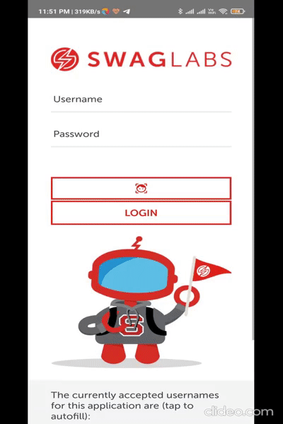

# POC on WebdriverIO tool.

## Recording of the user journey test!


## What is it all about?
This project is my first interaction with WebDriverIO. This project has sample test code for "Sauce labs demo app". 
I have covered the following scenarios:
1. Login scenario. 
2. User journey to buy the product using the app.

## App
Sauce Labs demo app can be downloaded from [here][]

## Why was this project created?
As I was learning the tool, I thought I should upload the project in github so it helps others as well who are planning to learn this tool and also it would help me in the future to refer the code.

## Installation:
You need to have the following installed in your machine:
1. Node (Latest Version).
2. npm(Latest Version).
3. Install WebdriverIO using the command: `npm install -D webdriverio`.
4. Install WebdriverIO CLI using the command: `npm install @wdio/cli` and update the set the wdio config file using command: `npx wdio config`. (Refer for more details, if you face any problem while setting up the project refer the following official link of [WebdriverIO][]).
5. Setup babel for your project using the command: `npm install -D @babel/core @babel/cli @babel/preset-env @babel/register`. You will also need to setup the `babel.config.js` as below: 
```
module.exports = {
    presets: [
        ['@babel/preset-env', {
            targets: {
                node: 'lts'
            }
        }]
    ]
}
```
Refer [Babel Setup][] for more details.

6. Since I am also using Video Reporter for recording the video of the tests, you need to install the plugin for `Video Reporter` as well. You can do that by simply typing the command: `npm install wdio-video-reporter`. 
Add the reporter to config: At the top of the `wdio.conf.js-file`, require the library:
`const video = require('wdio-video-reporter');`
Then add the video reporter to the configuration in the `reporters` property:
```
reporters: [
    [video, {
      saveAllVideos: true,       // If true, also saves videos for successful test cases
      videoSlowdownMultiplier: 3, // Higher to get slower videos, lower for faster videos [Value 1-100]
    }],
  ],
```
Since, this project is for mobile app, you need to set the `"deviceType": "phone"`, in the `capabilities` for appium section inside the `wdio.config.js`.
Refer [Video-Reporter Setup][] for more details.

7. For running the tests, you need to type the command: `npm test`.

8. I have used `Gestures.js` for performing swipe gestures, from the [appium-boilerplate][] project.

## Talking more about the Scenarios Covered in this project:
As far as the tests are concerned, covering the login scenario is one of the basics of automation testing and many automation engineers are well versed in writing the code for it and covering it in their automated tests. However, I have seen in recent times that most of the testers struggle to write the user journeys. Though the app testing is done in isolated tests but I think its necessary to cover the user journeys in the tests so we test as per the use case the way an end-user uses the app.
Hence, apart from the login scenario I have covered the following user journey as sample tests in this project. Details are as follows:

### User Journey : Buy a product and complete checkout.
1. Login in the app.
2. Click on a product - "Sauce Labs Backpack".
3. Scroll the page to "Add to Cart" button and click on it.
4. Get the Product name, Product description and Price of the product and check it with the test data.
5. Go to "Cart" on right top of the screen and click on it.
6. Check Product name, Product description and Price.
7. Click on "Checkout" button.
8. Enter "First Name", "Last Name" and "Postal code".
9. Click on "Continue" button.
10. Check Product name, Product description and Price.
11. Check Item Total, Tax and Total Amount.
12. Click on Finish.
13. Check Order completion Title: "Thank you for you order".
14. Check Order text: "Your Order has been dispatched, and will arrive just as fast as the pony can get there!".
 
## Need Assistance?
* Discuss your queries by writing to me @ mohammadfaisalkhatri@gmail.com
* Connect me at [LinkedIn][] or [Twitter][]

 ## :star: What you do if you like the project?
* Spread the word with your network.
*  **Star** the project to make the project popular.

 
[linkedIn]: https://www.linkedin.com/in/faisalkhatri/
[Twitter]: https://twitter.com/mfaisal_khatri
[Getting Started]: https://webdriver.io/docs/gettingstarted
[Babel Setup]: https://webdriver.io/docs/babel
[Video-Reporter Setup]: https://webdriver.io/docs/wdio-video-reporter/
[appium-boilerplate]: https://github.com/webdriverio/appium-boilerplate
[here]: https://github.com/saucelabs/sample-app-mobile/releases